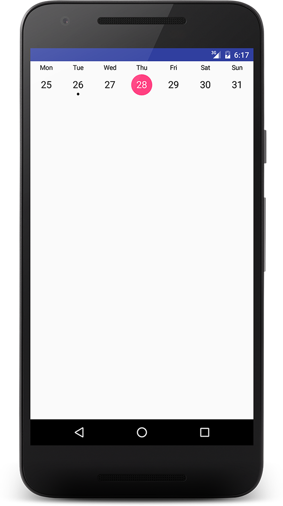

# WeekDatePicker

WeekDatePicker is a lightweight implementation of week date picker for Android. It is based on a View instead of ViewGroup. That gives it benefit of being memory efficient, fast and adds ability of indefinite scrolling.

Date implementation is based on Java 8 Date Time backport [threeten](http://www.threeten.org/)

## Example


Source code with examples is included in repository.

## Dependencies
### Gradle
```
compile "blaz.solar:week-date-picker:1.0"
```

## Usage
```xml
<LinearLayout xmlns:android="http://schemas.android.com/apk/res/android"
    xmlns:app="http://schemas.android.com/apk/res-auto"
    android:orientation="vertical"
    android:layout_width="match_parent"
    android:layout_height="match_parent">

    <solar.blaz.date.week.WeekDatePicker
        android:id="@+id/date_picker"
        android:layout_width="match_parent"
        android:layout_height="wrap_content"
        android:paddingTop="5dp"
        android:paddingBottom="5dp"
        android:textSize="18sp"
        android:textColor="@color/date_picker_text_color"
        app:labelTextSize="12sp"
        app:labelPadding="5dp"
        app:dayBackground="@drawable/date_picker_day_bg"
        app:indicatorDrawable="@drawable/date_picker_indicator"
        app:firstDayOfWeek="monday"/>

</LinearLayout>

```
